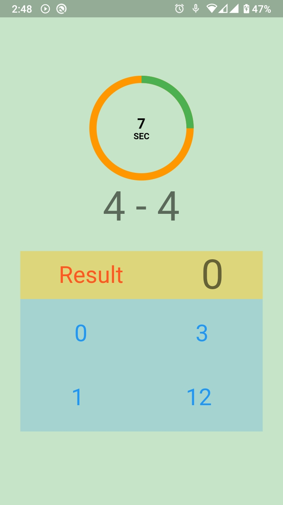

# Flutter Quick Math Game with MVVM and Provider
"Quick Math Brain Test" is an exciting and challenging game that tests your math skills and sharpness. In this game, players are presented with a series of randomly generated math problems that they need to solve within a set time limit. The problems include addition, subtraction, multiplication, and division, and they get progressively harder as the player progresses through the game.

As the player solves each problem, their score is updated, and they can see their progress in real-time. The timer counts down, adding an element of pressure and excitement to the game. With every correct answer, the player earns points, and their score is displayed on the screen.

The game is designed for players of all ages and math abilities, making it perfect for families and friends to play together. The fast-paced, adrenaline-fueled gameplay will keep players on their toes and keep them coming back for more.

So if you're up for a challenge and want to test your math skills, give "Quick Math Brain Test" a try today!

1. MVVM Architecture.

2. Unlimited Math

3. Timer and Sounds

## Installation
After cloning this repository, Run the following commands:
```bash
  flutter pub get
```


## Screenshot




## 🔗 Links
[](https://www.linkedin.com/arrahmanbd)

[](info/apps.apk)

## Give a Like and Don't forget to follow.